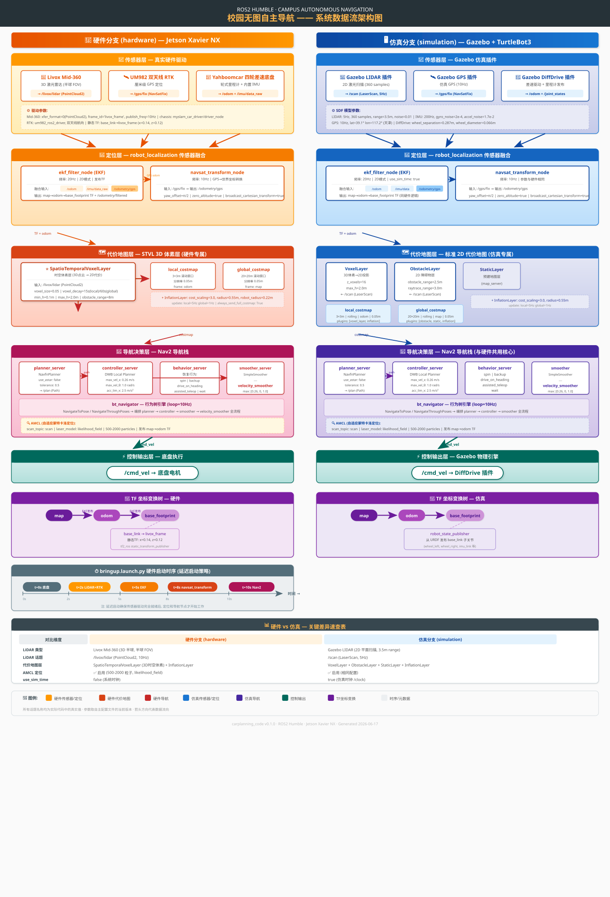

# 🚗 校园无图自主导航系统 —— 架构说明文档

> 面向小白的完整项目解读 · 配合 SVG 架构图食用效果最佳

---

## 一、这项目是干嘛的？

简单说：**让一台小车在校园里自己认路、自己开，不需要预先铺设任何导轨或地图。**

它靠三样东西感知世界：

| 传感器 | 型号 | 它能干什么 |
|--------|------|-----------|
| 激光雷达 | Livox Mid-360 | 用激光扫描周围 3D 环境，检测障碍物 |
| RTK 定位 | UM982 双天线 | 厘米级 GPS 定位，知道自己在地球上的精确位置 |
| 底盘传感器 | Yahboomcar 内置 | 轮子转了多少圈（里程计）+ 车身姿态（IMU） |

这三股数据汇入大脑（ROS2 Nav2 导航栈），大脑算出安全路径，发速度指令给轮子，车就自己走了。

---

## 二、从 10000 米高空看整体架构

```
┌──────────────────────────────────────────────────────────────────┐
│                        传感器层 (Sensors)                         │
│  LiDAR 扫环境  │  RTK 定位置  │  底盘里程计 + IMU 知姿态          │
└──────────────────────┬──────────────────────────────────────────┘
                       │ 原始数据流入
                       ▼
┌──────────────────────────────────────────────────────────────────┐
│                       定位层 (Localization)                       │
│          EKF 把里程计+IMU+GPS 三合一 → 机器人精确位姿              │
└──────────────────────┬──────────────────────────────────────────┘
                       │ TF 坐标变换 + 位姿
                       ▼
┌──────────────────────────────────────────────────────────────────┐
│                     代价地图层 (Costmap)                          │
│         STVL 3D体素层 把 LiDAR 点云变成"哪里能走哪里不能走"        │
└──────────────────────┬──────────────────────────────────────────┘
                       │ 代价地图
                       ▼
┌──────────────────────────────────────────────────────────────────┐
│                     导航决策层 (Navigation)                       │
│         全局路径规划 (Navfn) → 局部轨迹 (DWB) → 速度平滑           │
└──────────────────────┬──────────────────────────────────────────┘
                       │ /cmd_vel 速度指令
                       ▼
┌──────────────────────────────────────────────────────────────────┐
│                      控制执行层 (Control)                         │
│                    底盘电机转动，车开始走                           │
└──────────────────────────────────────────────────────────────────┘
```

**一句话总结**：传感器收集数据 → EKF 融合定位 → STVL 建代价地图 → Nav2 规划路径 → 发指令给底盘。

---

## 三、完整数据流架构图 (SVG)

> 下图是极致详细的节点级数据流图，包含所有 ROS2 话题名称、TF 变换、启动时序和关键参数。
> 点击图片可以在新标签页中放大查看。



---

## 四、逐层详解（配合上图阅读）

### 4.1 传感器层 —— 机器人的"眼睛和耳朵"

在这一层，三种传感器各自发布数据到 ROS2 话题上：

**🔌 硬件分支（真实机器人）：**

| 传感器 | 发布的话题 | 数据类型 | 频率 |
|--------|-----------|----------|------|
| Livox Mid-360 激光雷达 | `/livox/lidar` | `PointCloud2` (3D 点云) | 10Hz |
| UM982 RTK GPS | `/gps/fix` | `NavSatFix` (经纬度) | — |
| 底盘里程计 | `/odom` | `Odometry` (里程计) | — |
| 底盘 IMU | `/imu/data_raw` | `Imu` (惯性) | — |

**🖥️ 仿真分支（Gazebo 模拟）：**

| 传感器 | 发布的话题 | 数据类型 | 频率 |
|--------|-----------|----------|------|
| Gazebo LIDAR 插件 | `/scan` | `LaserScan` (2D 扫描线) | 5Hz |
| Gazebo GPS 插件 | `/gps/fix` | `NavSatFix` | 10Hz |
| Gazebo 差速驱动插件 | `/odom` | `Odometry` | — |

> ⚠️ **最大区别**：硬件用 3D 点云 (`/livox/lidar`)，仿真用 2D 激光扫描 (`/scan`)。这直接导致后面代价地图用了完全不同的插件！

---

### 4.2 定位层 —— "我在哪？"

使用 ROS2 的 `robot_localization` 包，里面有两个关键节点：

#### ekf_filter_node (扩展卡尔曼滤波器)

把三股数据**融合**成机器人的精确位姿：

```
/odom (轮速)  ─────────┐
/imu/data_raw (姿态) ──┼──→ EKF ──→ map→odom→base_footprint 坐标变换
/odometry/gps (GPS)  ──┘            └→ /odometry/filtered (融合后的里程计)
```

**关键参数（`config/ekf.yaml`）：**
- `frequency: 20.0` — 每秒融合 20 次
- `two_d_mode: true` — 假设机器人在地面跑（2D 简化）
- `odom0: /odom` — 只用 X/Y 线速度和偏航角速度
- `imu0: /imu/data_raw` — 只用偏航和翻滚角速度
- `odom1: /odometry/gps` — 只用 X/Y 绝对位置

#### navsat_transform_node (GPS 坐标转换)

把 GPS 的经纬度转换成机器人能用的笛卡尔坐标：

```
/gps/fix (经纬度) ──→ navsat_transform ──→ /odometry/gps (x, y 米制坐标)
```

**关键参数（`config/navsat.yaml`）：**
- `yaw_offset: 1.5707963` — π/2，校正 GPS 天线朝向与车头朝向的夹角
- `zero_altitude: true` — 只做 2D 定位，忽略高度
- `broadcast_cartesian_transform: true` — 发布 `utm→map` 坐标变换

---

### 4.3 代价地图层 —— "哪里能走？哪里是障碍？"

这是硬件和仿真**差异最大**的一层。

#### 硬件分支：STVL 时空体素层

```
/livox/lidar (PointCloud2, 10Hz)
        │
        ▼
SpatioTemporalVoxelLayer  ← ⭐ 核心！硬件专属
    │ voxel_size=0.05m (每个体素 5cm³)
    │ voxel_decay=15s 局部 / 60s 全局 (体素过期时间)
    │ min_h=0.1m, max_h=2.0m (关心的障碍物高度范围)
    │ obstacle_range=8m, raytrace_range=10m
        │
        ├──→ local_costmap  (3×3m,  odom 坐标系, 跟车移动的局部地图)
        └──→ global_costmap (20×20m, map 坐标系, 全局地图)
                     │
                     └──→ InflationLayer (膨胀层)
                           cost_scaling=3.0, radius=0.55m
                           (把障碍物"吹胖", 防止机器人贴边撞上)
```

**STVL 有什么特别？** 普通 2D 代价地图只能理解"某个 XY 位置有没有障碍"。STVL 多了两个维度：
- **空间 Z 轴**：能分辨障碍物的高度，不会被地面反射误判
- **时间维度**：体素会随时间衰减（`voxel_decay`），动态障碍物走过后的区域会逐渐恢复为可通行

#### 仿真分支：标准 2D 代价地图

```
/scan (LaserScan, 5Hz)
        │
        ├──→ VoxelLayer (3D 体素投影到 2D)
        │      z_voxels=16, 每层 5cm
        │
        └──→ ObstacleLayer (标准 2D 障碍物层)
               obstacle_range=2.5m, raytrace_range=3.0m
                     │
                     ├──→ local_costmap  (3×3m,  odom)
                     └──→ global_costmap (20×20m, map)
                                │
                                └──→ StaticLayer (预建静态地图)
```

> **一句话**：硬件用 3D 时空体素分析点云，仿真用标准 2D 层分析激光扫描线。

---

### 4.4 导航决策层 —— "怎么走？"

导航栈包含 5 个核心服务，由行为树 (`bt_navigator`) 编排执行顺序。

#### 工作流程：

```
目标点 (x, y, θ)
     │
     ▼
planner_server (全局规划)
     │ NavfnPlanner (A* 禁用, 使用 Dijkstra)
     │ 在 global_costmap 上找一条从当前位置到目标的最短安全路径
     │ → 发布 /plan (Path)
     ▼
controller_server (局部控制)
     │ DWB Local Planner
     │ 跟踪全局路径, 同时避让 local_costmap 上的动态障碍
     │ max_vel_x=0.26m/s, max_vel_θ=1.0rad/s
     │ 7 个评分器: RotateToGoal, Oscillation, BaseObstacle, GoalAlign, PathAlign, PathDist, GoalDist
     ▼
smoother_server (路径平滑)
     │ SimpleSmoother, 1000 次迭代
     ▼
velocity_smoother (速度平滑)
     │ 限制加速度, 防止急停急启
     │ max_accel=[2.5, 0, 3.2]
     ▼
/cmd_vel (最终速度指令 → 底盘)
```

#### 卡住时怎么办？behavior_server 提供恢复行为：

| 行为 | 作用 |
|------|------|
| `spin` | 原地旋转, 换个角度看看 |
| `backup` | 后退一段距离 |
| `drive_on_heading` | 盲开一段 (清代价地图后) |
| `assisted_teleop` | 请求人工遥控接管 |
| `wait` | 等待一会儿 |

> 两个分支的 Nav2 参数**几乎完全相同**，区别仅在于 `use_sim_time`（硬件=false, 仿真=true）和代价地图插件配置。

---

### 4.5 控制执行层 —— 车终于动了

```
/cmd_vel (geometry_msgs/Twist)
    │
    │  linear.x  = 前进/后退速度 (m/s)
    │  angular.z = 旋转角速度 (rad/s)
    │
    ▼
硬件: myslam_car_driver → 底盘电机
仿真: Gazebo DiffDrive 插件 → 物理引擎
```

---

## 五、TF 坐标变换树 —— "谁相对于谁在哪？"

ROS2 用 TF (Transform) 系统管理坐标系之间的关系。

```
map (世界原点, EKF 定义)
  │
  └──→ odom (里程计原点, EKF 发布)
          │
          └──→ base_footprint (机器人在地面的投影点, EKF 发布)
                  │
                  └──→ base_link (机器人几何中心)
                          │
                          ├──→ livox_frame (激光雷达, 静态偏移 x=0.14, z=0.12)
                          ├──→ wheel_left
                          └──→ wheel_right
```

**简单理解**：
- `map → odom`：修正里程计的累积漂移（GPS 提供绝对位置）
- `odom → base_footprint`：里程计提供连续运动估计
- `base_link → livox_frame`：安装时的固定偏移（0.14m 前, 0.12m 上）

---

## 六、硬件启动时序 —— 为什么要等？

`bringup.launch.py` 不是同时启动所有节点，而是**梯次启动**：

```
t=0s   ─── 底盘驱动启动 (必须最先, 提供 /odom 和 /imu)
t=2s   ─── LiDAR 驱动 + RTK 驱动 (传感器需要初始化时间)
t=5s   ─── EKF 节点 (等传感器数据开始发布)
t=8s   ─── navsat_transform (等 EKF 先跑起来获取基准)
t=10s  ─── Nav2 导航栈 (最后启动, 等所有数据流就绪)
```

**为什么要这样？** 如果一股脑全启动, EKF 可能因为 `/odom` 还没来而报错, Nav2 可能因为 TF 还没发布而崩溃。顺序启动保证每一步的依赖都已就绪。

---

## 七、硬件 vs 仿真速查表

| 维度 | 硬件 (hardware) | 仿真 (simulation) |
|------|----------------|-------------------|
| **计算平台** | Jetson Xavier NX | 你的电脑 |
| **LiDAR** | Livox Mid-360 (3D 半球) | Gazebo LIDAR (2D 平面) |
| **LiDAR 话题** | `/livox/lidar` (PointCloud2) | `/scan` (LaserScan) |
| **代价地图核心** | STVL 时空体素层 | VoxelLayer + ObstacleLayer |
| **时钟** | 系统时钟 (真实时间) | `/clock` 仿真时间 |
| **GPS** | UM982 双天线 RTK (厘米级) | Gazebo GPS 插件 (噪声仿真) |
| **静态地图** | 不加载 (无图导航) | 可选 StaticLayer |
| **Rviz2** | ❌ 远程运行 (Xavier NX 太弱) | ✅ 本地直接开 |

---

## 八、项目文件结构

```
carplanning_code/src/
├── CMakeLists.txt                  # 构建配置 (只安装 config/ 和 launch/)
├── package.xml                     # 包元数据 + 依赖声明
├── README.md                       # 项目说明 (中文)
├── CLAUDE.md                       # AI 助手指南
├── config/
│   ├── ekf.yaml                    # EKF 传感器融合参数
│   ├── navsat.yaml                 # GPS 坐标转换参数
│   ├── nav2_params.yaml            # Nav2 导航栈参数 (硬件版, use_sim_time=false)
│   └── nav2_params.yaml.bak        # Nav2 参数备份 (仿真版, use_sim_time=true)
├── launch/
│   ├── bringup.launch.py           # ⭐ 硬件一键启动 (梯次启动所有节点)
│   ├── mid360.launch.py            # Livox Mid-360 雷达驱动
│   ├── localization.launch.py      # 单独启动 EKF (遗留, 路径可能过期)
│   ├── nav2.launch.py              # 单独启动 Nav2 (遗留)
│   └── sim.launch.py               # 仿真启动 (仅 simulation 分支可用)
├── models/turtlebot3_waffle/       # Gazebo SDF 模型 (仿真用)
├── urdf/
│   ├── turtlebot3_waffle.urdf      # 机器人 URDF 描述 (含 Gazebo 插件)
│   └── common_properties.urdf      # 材质颜色定义
├── worlds/turtlebot3_world.world   # Gazebo 仿真世界 (天津坐标)
└── docs/
    ├── architecture.svg            # 系统架构图 (SVG)
    └── architecture.md             # 你正在读的这份文档
```

---

## 九、依赖工作空间一览

本项目依赖以下外部 ROS2 包（位于 `/ros2_ws/workspace/` 同级目录）：

| 包路径 | 提供什么 | 用途 |
|--------|---------|------|
| `myslam_car/` | `myslam_car_driver` | Yahboomcar 底盘驱动节点 |
| `livox/` | `livox_ros_driver2` | Livox Mid-360 雷达驱动 |
| `rtk_um982/` | `um982_ros2_driver` | UM982 RTK GPS 驱动 |
| `spatio_temporal/` | `spatio_temporal_voxel_layer` | STVL 3D 代价地图插件 |

---

## 十、常见问题 FAQ

**Q: 为什么不直接用 GPS 导航, 还要 EKF？**
A: GPS 虽然绝对精度高, 但更新频率低 (通常 5-10Hz)、有遮挡会丢信号。轮式里程计更新快 (20Hz+)、不依赖外部信号。EKF 把两者的优点结合：用里程计做高频连续估计, 用 GPS 定期纠正累积误差。

**Q: STVL 和普通代价地图到底有什么区别？**
A: 普通代价地图处理的是 2D 激光扫描线, 只能标记"某个 XY 位置是障碍"或"不是障碍"。STVL 维护的是一个 3D 体素网格 (XYZ), 而且每个体素有"生存时间"——随时间衰减。这意味着：地面反射不会被误判 (因为知道它的 Z 高度为 0), 走过的人会"消散" (过了 voxel_decay 时间后该区域恢复可通行)。

**Q: 仿真和硬件能共用同一套参数吗？**
A: Nav2 的核心参数 (速度限制、规划器配置) 可以共用。但代价地图配置完全不同——硬件用 STVL 订阅 `/livox/lidar`, 仿真用 VoxelLayer/ObstacleLayer 订阅 `/scan`。另外 `use_sim_time` 必须设为不同的值。

**Q: 为什么不在 Xavier NX 上跑 Rviz2？**
A: Xavier NX 是嵌入式 ARM 平台, GPU 资源有限。3D 可视化 (PointCloud2 渲染 + costmap 显示) 会吃满 CPU/GPU, 导致导航节点延迟增大甚至掉线。正确做法是在另一台 x86 电脑上开 Rviz2, 通过网络订阅 Xavier NX 的话题。

---

> 📐 本架构图基于 carplanning_code v0.1.0, ROS2 Humble, hardware 分支 `09580d8`
>
> 🖼️ SVG 图单独文件: [`architecture.svg`](architecture.svg) — 可拖到浏览器中单独放大查看
